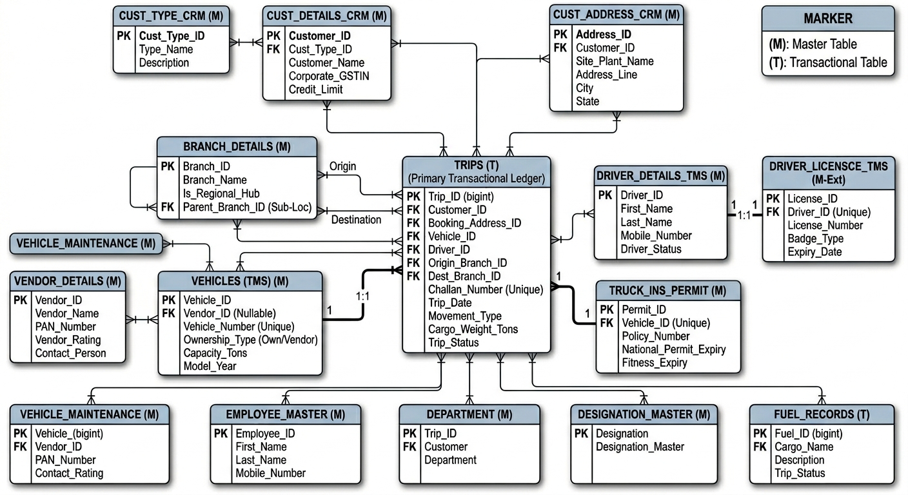
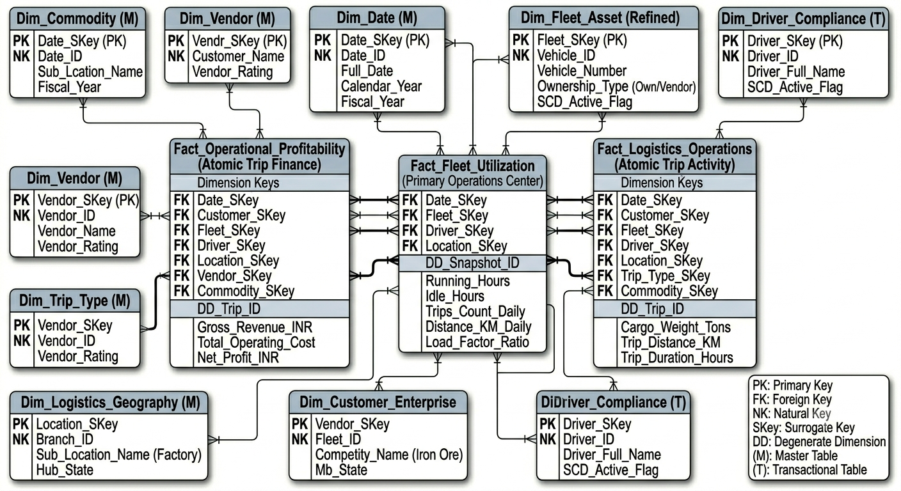
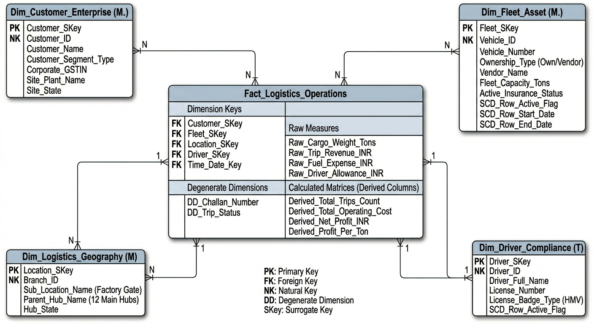

# ADLS-GOLD-TO-SQL-SERVER-OLAP
MOVING THE GOLD FACT AND DIMENTIONS TO OLAP FOR DATA WAREHOUSING AND ANALYTICS

## ASKING QUESTIONS TO SOURCE TEAM

### 1.BUISESNESS CONTEXT AND OWNERSHIP
  1.  WHO OWNS THE DATA                              --->  source team                  
  2.  THE BUISESNESS PROCESS IT SUPPORTS             --->  source oltp oracle moved to adls gen2 gold cleaned data
  3.  SYSTEM AND DATA DOCUMENTATIONS                 --->  provided the doc
  4.  DATA MODEL AND DATA CATALOG                    --->  er diagram, fact and dimention tables, the columns need to be ingested, along with source er, master, transactional etc

### 2. architecture and technology stack
  1.  HOW DATA IS STORED  --->  AZURE ADLS GEN2 CONTAINER
  2.  INTEGRATION CAPABLITY ---> LINKED SERVICES (USE THIS), API, DIRECT DB

### 3. EXTRACT AND LOAD
  1.  INCREMENTAL VS FULL  --->  FULL(5 YEARS) 1 YEAR AT A TIME OR FULL ONCE + INCREMENTAL
  2.  DATA SCOPE AND HISTORICAL NEEDS  --->  FOR SOME OF COLUMNS WE NEED TO HAVE UPSERT BUT SOME WE NEED HISTORICAL TRACKING SCD-1, SCD-2
  3.  EXPECTED SIZE OF EXTRACTS   ---> HISTORICAL(5TB), INCREMENTAL DAILY(5-10GB)
  4.  DATA VOLUME LIMITATIONS ---> ANY ?
  5.  HOW WE CAN AVOID IMPACT THE SOURCE SYSTEM PERFORMANCE  --->?
  6.  AUTONTICATION AND AUTORIZATION and security ---> token password,ip, key vault

#### THE FACT TABLES ARE JOINED TOGETHER  IN ADLS FOR CREATING FACT AND DIM , DIMENSION TABLES ARE RESULT JOIN OF MASTER AND OTHER TABLES, WE NEED TO LOAD THE DATA INTO TARGET AND DO THE DATA WAREHOUSING AND HISTORICAL TRACKING

## ABOUT THE DATA IN OLAP MASTER AND TRANSACTIONAL TMS DATA

##### OLAP TABLES DETAILS   MASTER(M) TRANSACTIONAL(T)
    CUST_DETAILS_CRM (M)	Core Clients: Defines your major corporate customers like Tata Steel or Jindal. This table stores billing terms, credit limits, and key tax data (GSTIN).

    VEHICLES (TMS) (M)	The Fleet: This is the core inventory master. It manages your 300+ own trucks and active vendor trucks. It defines ownership (Own vs. Vendor) and physical capabilities (Capacity_Tons, Model_Year).

    BRANCH_DETAILS (M)	Operational Footprint: Maps out your 12 primary hub locations and all their factory/mine-based sub-locations across India. This defines the geography of your business.

    DRIVER_DETAILS_TMS (M)	Personnel: The definitive master roster for all personnel operating your vehicles. This table tracks who is on your staff and their current operational status (Active/Suspended).

    VENDOR_DETAILS (M)	Partners: This table is essential for managing vendor trucks. It stores the details of the fleet providers, aggregators, and maintenance vendors that you utilize, along with critical tax data (PAN_Number).

    CUST_ADDRESS_CRM (M)	Loading Locations: Since large customers have multiple operating sites, this master table maps specific plant gates, mine entrances, or port berths (e.g., Tata Steel Kalinganagar Gate 3).

    TRUCK_INS_PERMIT (M)	Asset Compliance: Stores critical legal details—National Permits, Insurance Policies, and Fitness certificates—linked 1:1 to every operational vehicle to ensure they are road-legal.

    DRIVER_LICENSCE_TMS (M)	Driver Compliance: Isolates mandatory licensing data—License Numbers, Badge Types (like HMV), and critical Expiry Dates—to prevent scheduling non-compliant drivers.

    CUST_TYPE_CRM (M)	Customer Segmentation: A lookup table used to categorize customers by industry segment (e.g., Factories, Mining, Racks, Ports).

    VEHICLE_MAINTENANCE (M)	Maintenance Schedule: While it tracks work (which can be a transactional log), in this schema, it is classified as (M) Master, likely representing maintenance plans, active work orders, or service registers rather than simple historic event logs.

    EMPLOYEE_MASTER (M)	Internal Staff: The definitive register for internal company staff (Administrators, HR, Management), used for organizational tracking, department mapping, and likely linked to payroll functions.

    DESIGNATION_MASTER (M)	Org Roles: A standardized organizational lookup defining corporate titles and roles across the entire enterprise.

    DEPARTMENT (M)	Cost Centers: A master registry defining company divisions and departments, used to organize employees and track financial allocations per cost center.

## ABOUT THE DATA IN ADLS AFTER JOINING DIFFERENT TABLES TO CREATE JUST BEFORE FACT AND DIMENSION TABLES (TILL NOW SCD NOT DONE)

#### ======================================================================
####  FINAL ENTERPRISE LOGISTICS OLAP ARCHITECTURE DOCUMENTATION
####  (INTEGRATED MULTI-STAR SCHEMA)
#### ======================================================================

#### DIMENSIONS

##### 1. Dim_Date
    Generation Source: System-generated calendar lookup matrix table.
    Analytical Purpose: Formally structures all time-series reporting across 7 years of history. Enables seamless drill-down (Financial Year > Quarter > Month > Week > Day/Night operational cycles). Critical for analyzing seasonal logistics demand curves during Indian monsoons.

    Key Configuration:
    * PK / SurrogateKey (OLAP): Date_SKey (integer)
    * Source / Natural Key (NK): N/A (System-generated)

    SCD Requirement: SCD Type 1 (Overwrite).
    * Why? Calendar structures, dates, and fiscal definitions are fixed. Any adjustments to fiscal boundaries are treated as foundational lookup or data cleansing fixes.

    Mandatory History Tracking Columns (Not Applicable for SCD Type 1).

##### 2. Dim_Customer_Enterprise
    OLTP Source Tables to Join: 
    CUST_DETAILS_CRM (M) -> (Left Outer Join) -> CUST_ADDRESS_CRM (M) -> (Left Outer Join) -> CUST_TYPE_CRM (M).
    Analytical Purpose: Provides a flattened, clean vector analyzing enterprise client types (e.g., Factory, Mining, Train Racks, Container Ports), corporate credit limit lines, and physical delivery nodes (e.g., specific factory dispatch gates or mine pits for Tata Steel, Jindal, or Rungta).

    Key Configuration:
    * PK / SurrogateKey (OLAP): Customer_SKey (integer)
    * Source / Natural Key (NK): Customer_ID

    SCD Requirement: SCD Type 1 (Overwrite).
    * Why? If a customer updates a corporate billing address or a pan-India GSTIN registry number, you only need the current active information. Historical trips do not need to be split for administrative changes.

    Mandatory History Tracking Columns (Not Applicable for SCD Type 1).

##### 3. Dim_Fleet_Asset (Refined)
    OLTP Source Tables to Join: 
    VEHICLES (TMS) (M) -> (Left Outer Join) -> TRUCK_INS_PERMIT (M).
    Analytical Purpose: Tracks capacity (tons), model compliance, and regulatory permit statuses. Enables fleet managers to isolate vehicle capabilities independently from the vendors supplying them. This table is mandatory for analyzing the core 300+ owned asset roster.

    Key Configuration:
    * PK / SurrogateKey (OLAP): Fleet_SKey (integer)
    * Source / Natural Key (NK): Vehicle_ID

    SCD Requirement: SCD Type 2 (History Track).
    * Why? Critical for asset optimization. If a vehicle starts as a 'VENDOR SUPPLIED' asset and you later purchase it, moving it into the 'OWNED FLEET' roster (Ownership_Type shifts VENDOR -> OWN), you MUST preserve historical trip contexts exactly as they occurred at that point in time.

    Mandatory History Tracking Columns (Required for SCD Type 2):
    * SCD_Row_Start_Date (timestamp): Date/time the vehicle record became active.
    * SCD_Row_End_Date (timestamp): Date/time the vehicle record was retired (NULL if active).
    * SCD_Row_Active_Flag (boolean): True (Active) / False (Historical).

##### 4. Dim_Vendor
    OLTP Source Tables to Join: 
    VENDOR_DETAILS (M).
    Analytical Purpose: Separates supplier/broker corporate profiles from specific truck assets. This enables vendor performance scoring, vendor payout terms optimization, financial liability exposure mapping, and high-level market-hire vs. owned-fleet cost-benefit reviews.

    Key Configuration:
    * PK / SurrogateKey (OLAP): Vendor_SKey (integer)
    * Source / Natural Key (NK): Vendor_ID

    SCD Requirement: SCD Type 1 (Overwrite).
    * Why? If a commercial transport vendor changes its banking PAN card number or undergoes a vendor group classification update, the current status should apply uniformly across active vendor assignments.

    Mandatory History Tracking Columns (Not Applicable for SCD Type 1).

##### 5. Dim_Logistics_Geography
    OLTP Source Tables to Join: 
    BRANCH_DETAILS (M) (Self-joined to flatten parent-child nodes).
    Analytical Purpose: Collapses your core network of 12 regional hubs and their highly distributed factory/mine sub-locations (e.g., *Jamshedpur Hub, Kalinganagar Plant Site, Paradip Port Berth*) across multiple Indian states into a highly performant, query-friendly geographic layout.

    Key Configuration:
    * PK / SurrogateKey (OLAP): Location_SKey (integer)
    * Source / Natural Key (NK): Branch_ID

    SCD Requirement: SCD Type 1 (Overwrite).
    * Why? This handles physical corporate hierarchy. If an internal data entry operator accidentally maps a factory dispatch sub-gate to the wrong regional parent hub, it is corrected immediately via an overwrite.

    Mandatory History Tracking Columns (Not Applicable for SCD Type 1).

##### 6. Dim_Driver_Compliance
    OLTP Source Tables to Join: 
    DRIVER_DETAILS_TMS (M) -> (Inner Join) -> DRIVER_LICENSCE_TMS (M).
    Analytical Purpose: Profiles the active driver pool, evaluating delivery performance against critical RTO licenses, heavy vehicle badges (HMV), and document expiration parameters.

    Key Configuration:
    * PK / SurrogateKey (OLAP): Driver_SKey (integer)
    * Source / Natural Key (NK): Driver_ID

    SCD Requirement: SCD Type 2 (History Track).
    * Why? If a driver is promoted from a sub-location bypass operator to an interstate heavy vehicle long-haul driver, or transfers branches, their past trips must stay bound to their profile at that exact time.

    Mandatory History Tracking Columns (Required for SCD Type 2):
    * SCD_Row_Start_Date (timestamp): Date/time the driver record became active.
    * SCD_Row_End_Date (timestamp): Date/time the driver record was retired (NULL if active).
    * SCD_Row_Active_Flag (boolean): True (Active) / False (Historical).

##### 7. Dim_Trip_Type
    OLTP Source Tables to Join: 
    Derived from distinct operational classifications in TRIPS (T).
    Analytical Purpose: Standardizes operational trip classifications (e.g., *Internal Movement, Inbound Plant Supply, Outbound Finished Product, Interstate Long-Haul, Train Rack Shifting, Port Container Movement*) for clean, uniform filtering across all business dashboards.

    Key Configuration:
    * PK / SurrogateKey (OLAP): Trip_Type_Key (integer)
    * Source / Natural Key (NK): N/A (Derived)

    SCD Requirement: SCD Type 1 (Overwrite).
    * Why? These operational classifications are static baseline parameters used to group trip types across the business.

    Mandatory History Tracking Columns (Not Applicable for SCD Type 1).

##### 8. Dim_Commodity
    OLTP Source Tables to Join: 
    System lookup definition table or derived material master values.
    Analytical Purpose: Essential for the core business segment. Breaks down tonnage and operational volumes by the physical product being moved (e.g., *Iron Ore, Coal, Pellets, Steel Coils, Slag, Limestone, Finished Goods*), directly identifying which material types generate the best margins.

    Key Configuration:
    * PK / SurrogateKey (OLAP): Commodity_Key (integer)
    * Source / Natural Key (NK): N/A (Derived)

    SCD Requirement: SCD Type 1 (Overwrite).
    * Why? Material classifications are fixed physical assets and do not change structurally over time.

    Mandatory History Tracking Columns (Not Applicable for SCD Type 1).

#### FACTS

##### 1. Fact_Fleet_Utilization (PRIMARY OPERATIONS CENTER)
    OLTP Source Tables to Populate: 
    Consolidation of VEHICLES (TMS) daily status logs and operational state snapshot tables.
    Granularity: Daily Snapshot Grain (1 Row = 1 Unique Vehicle per Calendar Day).
    Analytical Purpose: The primary dashboard center. Provides immediate context for managing the 300+ owned fleet and active hired trucks across all hubs. Monitors operational uptime, load efficiency, and idle costs before they escalate. Confirmed Dimensions (Date, Fleet, Driver, Geography) provide cross-functional analysis.

    Key Configuration:
    * PK (OLAP): Auto-increment Fact ID or (Date_SKey + Fleet_SKey + Driver_SKey + Location_SKey + DD_Snapshot_ID)
    * Mandatory FKs (Links to Dimensions): Date_SKey, Fleet_SKey, Driver_SKey, Location_SKey.
    * Degenerate Dimension: DD_Snapshot_ID (Allows drilling to specific snapshot logs).

    Atomic Measures Stored (Not Aggregated, Stored Raw):
    * Running_Hours (decimal): Total active motion hours.
    * Idle_Hours (decimal): Total stationary time (plant gates/yards).
    * Trips_Count_Daily (int): Count of trip sequences completed.
    * Distance_KM_Daily (decimal): Total odometer coverage.
    * Load_Factor_Ratio (decimal): Ratio of capacity used vs. maximum tonnage potential.

##### 2. Fact_Operational_Profitability (ATOMIC TRIP FINANCE)
    OLTP Source Tables to Summarize & Merge: 
    TRIPS (T) + FUEL_RECORDS (T) + PAYROLL_SUMMARY (T) + TRIP_EXPENSE_ALLOWANCE (T).
    Granularity: Atomic Grain (1 Row = 1 Unique Physical Trip financial record).
    Analytical Purpose: The finance engine of the enterprise data warehouse. This isolates individual trip P&L for every single trip executed over 7 years of history, allowing accurate contrast of internal plant shifts vs interstate long-hauls, and OWNED vs VENDOR fleets.

    Key Configuration:
    * PK (OLAP): Auto-increment Fact ID or (Date_SKey + Customer_SKey + Fleet_SKey + ... + DD_Trip_ID)
    * Mandatory FKs (Links to Dimensions): Date_SKey, Customer_SKey, Fleet_SKey, Driver_SKey, Location_SKey, Vendor_SKey, Commodity_SKey.
    * Degenerate Dimension: DD_Trip_ID (Required for detailed drill-through actions).

    Atomic Measures Stored (Not Aggregated, Stored Raw):
    * Gross_Revenue_INR (decimal): Client billing value.
    * Fuel_Cost_INR (decimal): Direct trip fueling cost.
    * Driver_Cost_INR (decimal): Driver bhatta + base pay allocation.
    * Maintenance_Cost_INR (decimal): Allocated vehicle maintenance cost.
    * Toll_Cost_INR (decimal): Fastag toll deductions.
    * Other_Cost_INR (decimal): En-route operational expenses.

##### 3. Fact_Logistics_Operations (ATOMIC TRIP ACTIVITY)
    OLTP Source Tables to Populate: 
    TRIPS (T) (The central central central operational ledger).
    Granularity: Atomic Grain (1 Row = 1 Unique Physical Trip event).
    Analytical Purpose: The primary activity and volume tracking engine. Provides granular tracking of every transport movement across all hubs and sub-locations over 7 years of history, focusingstrictly on physical activity and core volume trends.

    Key Configuration:
    * PK (OLAP): Auto-increment Fact ID or (Date_SKey + Customer_SKey + Fleet_SKey + ... + DD_Trip_ID)
    * Mandatory FKs (Links to Dimensions): Date_SKey, Customer_SKey, Fleet_SKey, Driver_SKey, Location_SKey, Trip_Type_SKey, Commodity_SKey.
    * Degenerate Dimension: DD_Trip_ID (Required for detailed drill-through actions).

    Atomic Measures Stored (Not Aggregated, Stored Raw):
    * Cargo_Weight_Tons (decimal): Net scale weight.
    * Trip_Distance_KM (decimal): Physical distance traveled.
    * Trip_Duration_Hours (decimal): Total travel time (Delivered - Trip_Date).

#### ======================================================================
####  DOCUMENTATION END
#### ======================================================================
    

## OLAP ER DIAGRAM WE WANT TO ACHEAIVE

EARLIER TRIED TO ACHEIVE THIS, BUT WE WILL NOT CHOOSE

why 3 fact tables
That is a fundamental question in data warehouse design. The decision to implement a Multi-Star Schema architecture centered on three distinct fact tables—rather than attempting to force all metrics into a single 'Universal' fact table—is a technical necessity required to preserve the structural and mathematical integrity of our data over 7 years of deep operational history.

Attempting to build a single, universal star schema would create severe, unsolvable data logic conflicts known as Grain Mismatch (or Cardinality Mismatch). Our business fundamentally tracks different aspects of its operations at completely incompatible levels of detail (or 'grains').

If I were to generate a visualization of what our complex 7-year enterprise operational ecosystem looks like, you would see why these separate fact centers are required to manage this diverse data flow."

[A high-fidelity digital illustration visualizing a vast, structured 7-year enterprise operational data ecosystem as a flowing river or a powerful stream. This visualization would not show a traditional ER diagram; instead, it represents data as flowing, stylized streams with clear headers for each source system and its unique data nature, all moving over a symbolic historical timeline from left (the past) to right (the future).

The entire structure would flow through a timeline marked 'HISTORY TIMELINE (7-YEARS context)'.

Major, distinct data streams with unique graphical styles emerge from left and flow toward the center, representing the distinct business processes:

On the top: 'OPERATIONAL STATE SNAPSHOTS (DAILY STATUS)' (Utilization). This is represented as structured, consistent blocks or cells, illustrating a periodic, non-duplicate snapshot grain (e.g., Uptime Ratios, Cumulative Fuel).

In the middle: 'ATOMIC TRIP FINANCIALS (1 TRIP = 1 financial row)' (Profitability). This is shown as many individual, precisely linked packets of data (Revenue vs. Costs), emphasizing a high-cadence, non-cumulative grain.

On the bottom: 'ATOMIC TRIP ACTIVITY (1 TRIP = 1 physical movement event)' (Logistics). This is represented as specific, independent geometric shapes, again emphasizing distinct, low-level operational entries (Cargo, Route Duration).

All three streams flow into a unified historical data repository symbolized as a 'SHARED HISTORICAL LOGISTICS REPOSITORY', which is explicitly labeled as the '7-YEAR OPERATIONAL CONTEXT'.

The shared dimensions are shown as branching vectors from lookups into all three fact tables (Date, Fleet, Geography, Driver, Customer, Commodity, Vendor). The diagram emphasizes how each fact table maintains its structural integrity without data conflicts. The style is professional, vibrant blue/grey/orange, sharp, and consistent, visualizing logic instead of table structures.]

The Technical Breakdown: Solving Grain Conflict
"Here is the decisive technical reasoning why the single universal star fails and the Multi-Star is mandatory:

1. Grain Cardinality Collision (Mathematically Incompatible)
The main conflict is found between Fleet Utilization and our Atomic Trip facts. They are incompatible data types that do not mix:

Fact_Fleet_Utilization (Snapshot Grain): Records 1 row per Vehicle per Calendar Day. Its metrics are daily cumulative states (e.g., Fuel Amount used that entire day, total Running Hours for that entire day).

Fact_Operational_Profitability / Fact_Logistics_Operations (Atomic Grain): Records 1 row per Individual Physical Trip event. (Cargo Weight, Trip Revenue, Toll Cost). These are non-cumulative distinct transactions.

The Failure of a Single Fact: Imagine Own Truck 1 makes 10 short-haul internal plant shuttle trips on October 1st:

A single Universal table would contain 10 trip rows.

Because those 10 trips occurred on the same date for the same vehicle, the vehicle’s daily cumulative state (e.g., Fuel Used that entire day, total Idle Hours that entire day) would be duplicated 10 times.

The Verdict: Your fuel reporting would be 10x reality, and your uptime ratio calculation would collapse, corrupted by data multiplication. The Multi-Star schema is the mandatory structure that keeps these distinct grains separate, preserving operational integrity.

2. SCD Type 2 Historical Context Management
The Multi-Star architecture is decisive for maintaining Slowly Changing Dimension (SCD) Type 2 tracking over 7 years. You must track dimension history (e.g., when a truck ownership changes from 'VENDOR SUPPLIED' to 'OWNED FLEET', or when a driver changes base branches).

An atomic fact (like Logistics or Profitability) handles this perfectly. A change on October 1st only affects the new trips being made.

A daily snapshot fact (like Utilization) creates complex ambiguity in a universal fact. Do you update the daily snapshot for the entire day or just the trips? Multi-Star keeps snapshot logic separate from atomic trip logs, allowing historical analytical integrity to be preserved over deep history

